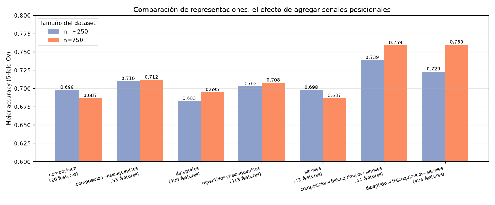
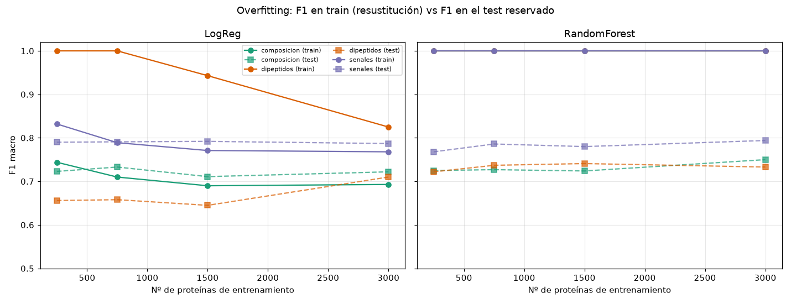
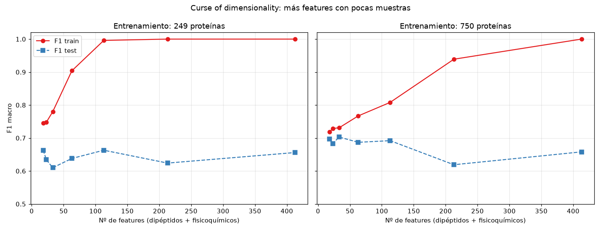
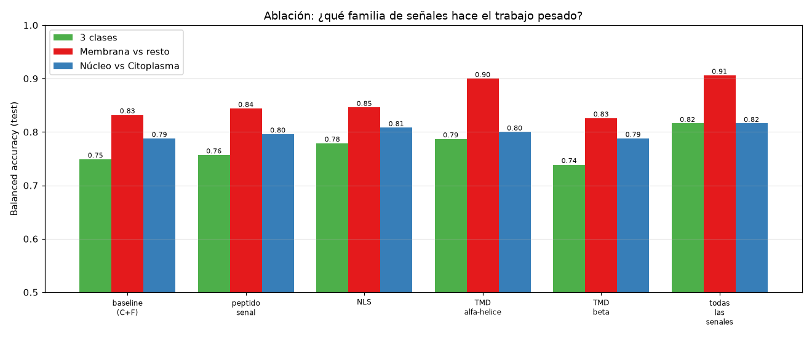

# where-is-my-protein 🧬📍

**Un práctico de Machine Learning aplicado a Bioinformática:** ¿se puede predecir en qué
parte de la célula termina una proteína (núcleo, citoplasma o membrana) mirando *únicamente*
su secuencia de aminoácidos?

Este repositorio contiene el material completo de una clase práctica de 4 horas para
estudiantes en etapa inicial de formación en Bioinformática, pensada para usarse después de
una clase teórica introductoria a Machine Learning. Combina **Python** (para construir el
dataset y explorar los datos con ayuda de IA) y **Orange Data Mining** (para clasificar y
comparar modelos de forma visual, sin necesidad de programar).

## El problema

Las proteínas cumplen funciones distintas según dónde se ubiquen dentro de la célula. La
pregunta central del práctico es simple de enunciar y nada trivial de responder:

> ¿Es posible predecir la localización subcelular de una proteína usando solo información
> derivada de su secuencia de aminoácidos?

Para responderla, los estudiantes construyen y comparan dos representaciones numéricas
distintas de una misma secuencia, entrenan varios modelos sobre cada una, y discuten **qué
se gana y qué se pierde** en cada representación — la idea pedagógica central es que el
desempeño de un sistema de ML depende tanto de cómo se representan los datos como del
algoritmo elegido.

## El dataset

- **Fuente:** [UniProt](https://www.uniprot.org/) (Swiss-Prot, entradas revisadas), proteínas humanas.
- **3 clases** mutuamente excluyentes: `Nucleus`, `Cytoplasm`, `Membrane`.
- **750 proteínas** (250 por clase), longitud entre 50 y 500 aminoácidos.
- Descargado automáticamente vía la API REST de UniProt, filtrando por keywords controladas
  (`KW-0539`, `KW-0963`, `KW-0472`) y descartando proteínas con localización ambigua (más de
  una de las tres keywords a la vez).
- Solo entradas con **evidencia experimental a nivel de proteína** (`existence:1`), para que la
  etiqueta no provenga de una inferencia por homología. La descarga está paginada y descarta
  secuencias con residuos no estándar.

## Las tres representaciones

| Representación | Analogía | Nº de features |
|---|---|---|
| **Bag of aminoácidos** | *bag of words* en NLP: se ignora el orden, solo importa la proporción de cada uno de los 20 aminoácidos | 20 + 13 fisicoquímicos |
| **Dipéptidos** | frecuencia de cada par de aminoácidos consecutivos — conserva algo de información local | 400 + 13 fisicoquímicos |
| **Señales posicionales** | composición + motivos biológicos detectados en posiciones concretas | 20 + 13 fisicoquímicos + 11 señales |

Las tres representaciones comparten **13 features fisicoquímicos globales**
(peso molecular, punto isoeléctrico, hidrofobicidad promedio, aromaticidad, índice de
inestabilidad, carga neta a pH 7, fracciones de estructura secundaria, índice alifático,
fracción de residuos cargados y coeficiente de extinción), calculados con
[Biopython](https://biopython.org/) (`Bio.SeqUtils.ProtParam`).

La tercera representación agrega **11 señales derivadas de la secuencia**, pensadas para
recuperar justamente la información *posicional* que las bolsas de fragmentos pierden:
péptido señal N-terminal, señales de localización nuclear (NLS monopartita y bipartita, más
densidad local de K/R) y dominios transmembrana de alfa-hélice (ventana de hidropatía de
Kyte-Doolittle) y una propensión a beta-hebra. Son heurísticas transparentes, no predictores
entrenados — el README y `data/README.md` discuten sus límites.

## El pipeline

```
UniProt (API REST, evidencia experimental)
       │
       ▼
data/01_construir_dataset.py  ──►  features_composicion_fisicoquimicos.csv
       │                            features_dipeptidos_fisicoquimicos.csv
       │                            features_composicion_senales_fisicoquimicos.csv
       ▼
notebooks/exploracion_*.ipynb  (exploración visual, asistida por IA)
       │
       ▼
orange/*.ows  (clasificación: Logistic Regression, Random Forest, SVM
                → Test and Score → Confusion Matrix → Rank)
       │
       ▼
   discusión y comparación de resultados
```

## Resultado

Comparación head-to-head con `data/02_comparar_representaciones.py` (mismas particiones,
5-fold; los valores en Orange pueden variar levemente según el *shuffle*). Se corre a dos
tamaños: **~250 proteínas** (el dataset de la versión original) y **750** (el actual). CA =
accuracy del mejor de los tres modelos (Logistic Regression, SVM, Random Forest).

| Representación | Features | CA ~250 | CA 750 |
|---|---|---|---|
| Composición | 20 | 0.698 | 0.687 |
| Composición + fisicoquímicos **(método original)** | 33 | 0.710 | 0.712 |
| Sólo dipéptidos | 400 | 0.683 | 0.695 |
| Dipéptidos + fisicoquímicos | 413 | 0.703 | 0.708 |
| Sólo señales | 11 | 0.698 | 0.687 |
| **Composición + fisicoquímicos + señales (nuevo)** | 44 | **0.739** | **0.759** |
| Dipéptidos + fisicoquímicos + señales | 424 | 0.723 | 0.760 |



Qué muestran estos números:

1. **El resultado original se reproduce.** A ~250 proteínas, dipéptidos + fisicoquímicos (0.703)
   no supera a composición + fisicoquímicos (0.710). Ampliar a 750 casi no cambia el panorama
   (0.708 vs 0.712): el problema no era sólo el tamaño del dataset.
2. **Más features no alcanza.** 400 dipéptidos rinden igual o apenas por encima de 20
   aminoácidos, y quedan muy por debajo de las señales incluso con 3000 de entrenamiento. Ver
   **Preguntas abiertas** más abajo.
3. **Las señales posicionales sí rompen el techo.** Composición + fisicoquímicos + señales llega
   a 0.759, ~5 puntos por encima del método original, en ambos tamaños.
4. **Casi toda la señal está en las 11 features nuevas.** "Sólo señales" (11 features) ya iguala
   a composición + fisicoquímicos (33); y agregar señales a los dipéptidos (0.760) no supera a
   agregarlas a la composición (0.759) — los dipéptidos siguen sin aportar.
5. **Membrana se despega.** Con señales, el F1 de Membrana pasa de ~0.76 a ~0.87, empujado por
   `tmd_alfa_*` y `senal_hidrofobicidad_max`. Los NLS ayudan a Núcleo/Citoplasma.

### Los intentos por romper el techo

Antes de llegar a las señales, probamos 3 formas de recuperar información posicional sin salir
de Orange / sin entrenar una red neuronal desde cero. Ninguna superó a la composición simple:

| # | Intento | Idea | Resultado |
|---|---|---|---|
| 1 | Alfabeto reducido | Agrupar los 20 aminoácidos en 6 categorías fisicoquímicas y contar pares de grupos (36 features en vez de 400) | Sin mejora |
| 2 | Composición N-terminal | Agregar la composición calculada solo sobre los primeros 30 residuos, donde suelen concentrarse señales de localización | Sin mejora |
| 3 | Ventana deslizante de residuos básicos | Buscar, en cualquier posición de la secuencia, el tramo de 7 o 12 residuos con mayor proporción de K/R (aproximando una NLS) | Sin mejora |
| 4 | **Señales biológicas explícitas** | Detectar péptido señal, NLS y TMD alfa-hélice con reglas interpretables | **Mejora** (BA ~0.82) |

El intento 1 apuntaba a resolver *sobreajuste* (demasiadas features para pocas muestras) y los
intentos 2-3 a recuperar *posición* con ventanas genéricas. La diferencia con las señales
biológicas es que las features no son solo "más" ni "posicionales": codifican **patrones
biológicos conocidos** (hidrofobicidad de membrana, clusters básicos de NLS). Es exactamente lo
que distingue a una señal de localización real, y por eso sí mueve la aguja.

## Preguntas abiertas, puestas a prueba

`data/03_experimentos.py` reserva un **conjunto de test que el entrenamiento nunca ve**: hasta
1000 proteínas por clase para entrenar (3000) y todo el resto queda aparte. Ese sobrante está
dominado por Membrana (2820: 2196 M / 499 N / 125 C), así que la evaluación se hace sobre su
subconjunto **balanceado** más grande posible (375, 125 por clase) y la métrica principal es
**balanced accuracy (BA)**, que no se deja engañar por el desbalance. Corre **tres experimentos**:
overfitting, curse of dimensionality y ablación de señales. Datos crudos:
`data/experimentos_resultados.csv`.

### Overfitting y "curse of dimensionality"

**Overfitting = F1 en el train (resustitución) menos F1 en el test.** Con Logistic Regression:

| Representación | F1 train (n=250) | F1 test (n=250) | brecha | F1 train (n=3000) | F1 test (n=3000) | brecha |
|---|---|---|---|---|---|---|
| Composición (33) | 0.744 | 0.723 | 0.020 | 0.693 | 0.722 | -0.030 |
| Dipéptidos (413) | **1.000** | 0.656 | **0.344** | 0.825 | 0.710 | 0.115 |
| Señales (44) | 0.832 | 0.790 | 0.042 | 0.768 | 0.787 | -0.019 |



- Los dipéptidos **memorizan** el train a n=250 (F1 1.000) y caen a 0.656 en test: overfitting
  clásico. Más datos reducen la brecha (0.344 → 0.115 a n=3000).
- Composición y señales casi no overfitean (brecha ≈ 0): pocas features informativas.
- Con Random Forest (figura, panel derecho) el F1 de train es ~1.000 siempre, y también se ve la
  brecha.

**La curse of dimensionality** se ve fijando pocas muestras y agregando features: el F1 de train
sube hacia 1 mientras el de test se estanca. Con n=250 y cada vez más dipéptidos (ordenados por
información):

| Nº de features | F1 train | F1 test | brecha |
|---|---|---|---|
| 18 | 0.745 | 0.663 | 0.082 |
| 63 | 0.904 | 0.638 | 0.266 |
| 213 | 1.000 | 0.624 | 0.376 |
| 413 | 1.000 | 0.656 | 0.344 |



- Aun así, la dimensionalidad no lo explica todo: la representación de señales (44 features) le
  gana a los dipéptidos (413) porque codifica posición, no porque tenga menos features.

### ¿Qué familia de señales hace el trabajo pesado?

Ablación: se parte de composición + fisicoquímicos y se agrega **una familia por vez** (BA,
train=3000, test reservado):

| Variante (+ C+F) | Features extra | 3 clases | Membrana vs resto | Núcleo vs Citoplasma |
|---|---|---|---|---|
| baseline | 0 | 0.749 | 0.832 | 0.788 |
| péptido señal | 3 | 0.757 | 0.844 | 0.796 |
| NLS | 5 | 0.779 | 0.846 | 0.808 |
| **TMD alfa-hélice** | 2 | **0.787** | **0.900** | 0.800 |
| TMD beta | 1 | 0.739 | 0.826 | 0.788 |
| todas | 11 | **0.816** | **0.906** | **0.816** |



- **TMD alfa-hélice hace el trabajo pesado** para separar Membrana (0.832 → 0.900) y es la
  familia que más sube el desempeño global (con sólo 2 features, +0.038).
- **NLS** es la única que mueve la aguja en el par más difícil, Núcleo vs Citoplasma
  (0.788 → 0.808), y también aporta al global.
- **Péptido señal** ayuda a Membrana, pero menos que el TMD.
- **TMD beta no aporta nada** (0.739, igual o peor que el baseline): los beta-barriles son raros
  en humano y la heurística no los captura.
- Las tres familias juntas superan a cualquiera sola (0.816): son complementarias.

### ¿Y embeddings de ESM-2? (alternativa implementada)

`data/04_esm2_embeddings.py` calcula un embedding por proteína con un modelo de lenguaje de
proteínas (ESM-2) y entrena un clasificador lineal encima, con el mismo train/test:

| Representación | Features | BA | F1 macro | F1 Núcleo | F1 Citoplasma | F1 Membrana |
|---|---|---|---|---|---|---|
| Composición + fisicoquímicos | 33 | 0.749 | 0.750 | 0.766 | 0.669 | 0.813 |
| Composición + fisicoquímicos + señales | 44 | 0.816 | 0.818 | 0.820 | 0.757 | 0.879 |
| **ESM-2 (8M)** | 320 | **0.853** | 0.855 | 0.838 | 0.803 | 0.925 |

- **Sí, ESM-2 es claramente mejor** (+4 puntos de BA sobre la mejor representación hecha a mano)
  y despega la clase difícil: F1 de Citoplasma 0.757 → 0.803.
- **No necesita GPU**: el modelo de 8M corre en CPU (y en Colab) en ~1-2 min para 750 proteínas.
- Guía práctica en `data/README.md` y notebook listo para Colab en
  `notebooks/esm2_embeddings_colab.ipynb`.

### ¿Es un problema de desbalance de clases?

No en este dataset, que está balanceado por construcción (y el test se balancea a propósito).
El desbalance **sí** importa si aparece: simulado sobre el pool de 3 clases con validación
cruzada,

| Proporción (Membrana : Núcleo : Citoplasma) | CA | F1 macro | F1 Citoplasma |
|---|---|---|---|
| 1:1:1 (balanceado) | 0.685 | 0.686 | 0.604 |
| 2:1:1 | 0.725 | 0.683 | 0.523 |
| 4:1:1 | 0.777 | 0.636 | 0.372 |

El desbalance **infla la accuracy** (la mayoría domina) mientras hunde el F1 de la minoría. Por
eso el experimento principal usa BA y un test balanceado.

### Próximos pasos (no implementado en este repo)

- [ ] **Reemplazar las heurísticas de señales por predictores entrenados:** SignalP o DeepSig
  para péptido señal, DeepTMHMM/TMbed para TMD (incluidos beta-barriles, que la heurística de
  este repo no resuelve) y DeepLoc para localización. La comparación "heurística simple vs
  modelo entrenado" es en sí misma una buena discusión.
- [ ] **Ajustar fino (fine-tuning) un ESM-2 chico** en vez de usarlo congelado + clasificador
  lineal, y comparar. En CPU es caro; requeriría GPU o un modelo muy chico.
- [ ] One-hot encoding + CNN sobre la secuencia completa (con un dataset más grande).

## Estructura del repositorio

```
where-is-my-protein/
├── data/
│   ├── 01_construir_dataset.py   # descarga UniProt + calcula todas las features
│   ├── 02_comparar_representaciones.py  # comparación head-to-head (validación interna)
│   ├── 03_experimentos.py        # overfitting, curse of dimensionality y ablación (test reservado)
│   ├── 04_esm2_embeddings.py     # embeddings ESM-2 (CPU/Colab) como representación alternativa
│   └── README.md
├── notebooks/
│   ├── exploracion_alumnos.ipynb            # con prompts sugeridos para IA, sin resolver
│   ├── exploracion_docentes_completa.ipynb  # resuelto, con gráficos de referencia
│   └── esm2_embeddings_colab.ipynb          # ESM-2 en CPU / Colab, listo para correr
├── orange/
│   ├── bag_of_aminoacidos.ows              # File → LR/RF/SVM → Test and Score → Confusion Matrix
│   ├── dipeptidos.ows                      # mismo esqueleto, para la representación de dipéptidos
│   └── senales_posicionales.ows            # ídem, + widget Rank para ver el peso de las señales
├── data_share/
│   ├── features_composicion_fisicoquimicos.csv
│   ├── features_dipeptidos_fisicoquimicos.csv
│   └── features_composicion_senales_fisicoquimicos.csv
├── docs/
│   ├── guia_alumnos.docx         # agenda, instrucciones paso a paso, preguntas de informe
│   └── guia_docentes.docx        # + setup técnico, resultados esperados, troubleshooting
├── requirements.txt
├── requirements-esm2.txt         # deps opcionales para ESM-2 (transformers; torch en Colab ya viene)
└── LICENSE
```

## Cómo usarlo

1. `pip install -r requirements.txt`
2. Correr `data/01_construir_dataset.py` (requiere conexión a internet) para generar los tres CSV.
   Opcional: correr `data/02_comparar_representaciones.py` para reproducir la tabla de resultados.
3. Abrir `notebooks/exploracion_docentes_completa.ipynb` y correr **Kernel → Restart & Run
   All** para reemplazar los gráficos de prueba por los reales.
4. Instalar [Orange Data Mining](https://orangedatamining.com/download/) (gratuito) y abrir
   los workflows de `orange/` para confirmar que cargan bien.
5. Repartir a los estudiantes: los 3 CSV, `notebooks/exploracion_alumnos.ipynb`, los `.ows`,
   y `docs/guia_alumnos.docx`.
6. Extensión ESM-2 (opcional, para grupos avanzados): abrir
   `notebooks/esm2_embeddings_colab.ipynb` en Google Colab (CPU), subir el CSV de señales y
   correr. Requiere `pip install transformers` (el notebook lo hace).

Instrucciones detalladas, agenda de la clase y guía de discusión: `docs/guia_docentes.docx`.

## Stack

Python · pandas · Biopython · scikit-learn (validaciones internas) · Orange Data Mining ·
UniProt REST API · ESM-2 / transformers (extensión opcional, corre en CPU)

## Motivación

Este práctico fue diseñado para introducir Machine Learning a estudiantes de Bioinformática
a partir de un problema biológico real, integrando manejo de datos públicos, ingeniería de
representaciones, y uso crítico de asistentes de IA como herramienta de trabajo (documentado
explícitamente, no evitado). El diseño pasó por varias iteraciones — incluyendo los 3 intentos
fallidos y la representación de señales que sí funcionó, documentados arriba — que terminaron
siendo, en sí mismos, parte de la lección.

## Licencia

MIT — ver [`LICENSE`](LICENSE). Usalo, adaptalo y compartilo libremente citando la fuente.
